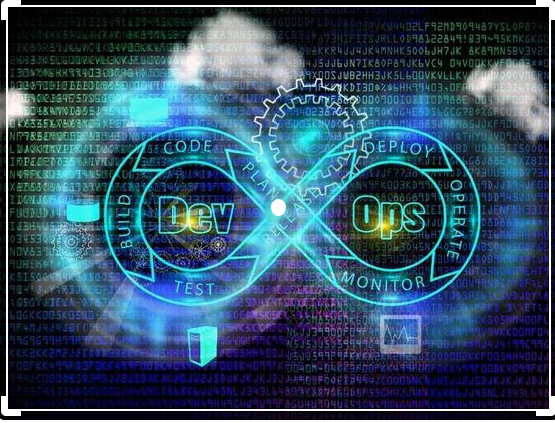

# World Of Games 
DevOps Course

---

# Image at [Docker Hub]
---
Game based mainly with Python, (`Using Git, Docker, Jenkins, Selenium, Rest API...`)
### CI-CD 
# Using jenkins to complete the CI-CD process:
---
- Checking out git repository for change as trigger
- Building a new image
- Run a container with the new image
- Test our new container (`e2e.py file`)
- The new Image is uploaded as a new version to Docker Hub
[Docker Hub](https://hub.docker.com/repository/docker/avi0610/world_of_games)
---
## Using

 

 

 
 
